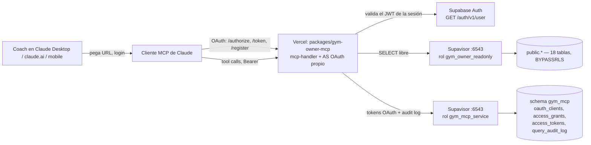
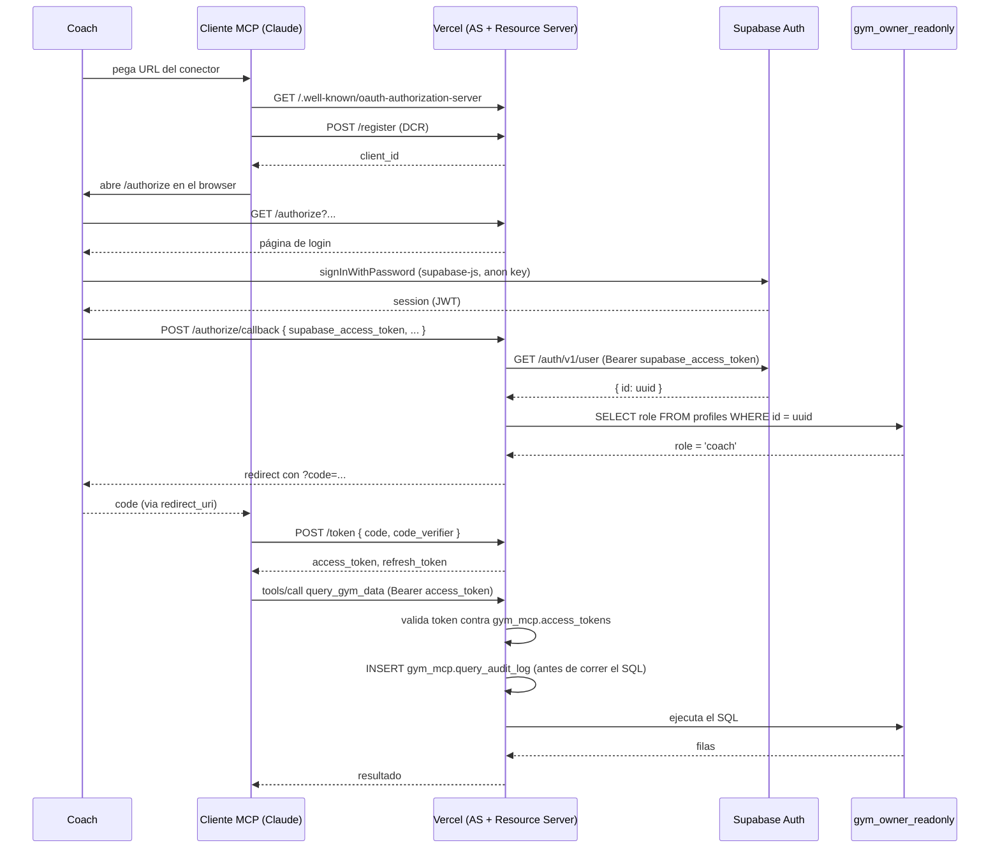

# Design: Acceso read-only de coaches vía MCP remoto en Vercel

**Status:** Approved
**Last updated:** 2026-09-12
**Aprobado por:** Máximo — 2026-09-12
**Requirements:** [requirements.md](./requirements.md)

## Overview

Un nuevo paquete `packages/gym-owner-mcp`, deployado como su propio proyecto
de Vercel, expone un server MCP remoto (Streamable HTTP, vía `mcp-handler`)
con una única tool de datos (`query_gym_data`) más `instructions`/`prompts`/
`resources`. El server implementa su propia Authorization Server OAuth 2.1
(PKCE + Dynamic Client Registration) porque Supabase Auth no se expone a sí
mismo como AS genérico para terceros: la verificación de identidad se delega
a Supabase Auth (el coach loguea con la cuenta que ya tiene), y el server
mapea esa identidad a `profiles` antes de emitir su propio token de acceso al
MCP. Los datos se leen con un rol Postgres nuevo y aislado
(`gym_owner_readonly`, `BYPASSRLS` + solo `SELECT`); la contabilidad propia
del server (clientes OAuth, tokens, auditoría) vive en un schema separado
(`gym_mcp`) con un segundo rol de menor privilegio (`gym_mcp_service`).

## Architecture



No toca: la app principal (otro proyecto de Vercel), `packages/mcp-server` ni
el rol `mcp_readonly` (US-8).

## Data model

### Rol de datos: `gym_owner_readonly`

```sql
CREATE ROLE gym_owner_readonly WITH
    LOGIN
    PASSWORD '<generada, gestionada como secreto de Vercel>'
    NOSUPERUSER NOCREATEDB NOCREATEROLE NOINHERIT NOREPLICATION
    BYPASSRLS
    CONNECTION LIMIT 10;   -- serverless: varias invocaciones concurrentes

ALTER ROLE gym_owner_readonly SET default_transaction_read_only = on;
ALTER ROLE gym_owner_readonly SET statement_timeout = '30s';
ALTER ROLE gym_owner_readonly SET idle_in_transaction_session_timeout = '15s';

GRANT USAGE ON SCHEMA public TO gym_owner_readonly;
GRANT SELECT ON ALL TABLES IN SCHEMA public TO gym_owner_readonly;
ALTER DEFAULT PRIVILEGES FOR ROLE postgres IN SCHEMA public
    GRANT SELECT ON TABLES TO gym_owner_readonly;
-- Sin USAGE sobre "mcp" ni ningún grant sobre packages/mcp-server (US-8).
```

Satisface US-3 y US-4. `BYPASSRLS` es la razón por la que no hace falta una
policy por tabla (ni mantenerla cuando se agreguen tablas nuevas).

### Rol de servicio: `gym_mcp_service`

Solo para la contabilidad propia del server — nunca toca `public`.

```sql
CREATE ROLE gym_mcp_service WITH
    LOGIN
    PASSWORD '<generada, distinta de la anterior>'
    NOSUPERUSER NOCREATEDB NOCREATEROLE NOINHERIT NOREPLICATION NOBYPASSRLS
    CONNECTION LIMIT 10;

ALTER ROLE gym_mcp_service SET statement_timeout = '10s';

CREATE SCHEMA IF NOT EXISTS gym_mcp;
GRANT USAGE, CREATE ON SCHEMA gym_mcp TO gym_mcp_service;
-- Las tablas de gym_mcp se crean con owner gym_mcp_service (o se les GRANT
-- explícito ALL sobre cada una). Sin RLS: el único rol que las toca es este.
```

### Tablas de `gym_mcp`

```sql
CREATE TABLE gym_mcp.oauth_clients (
    client_id     text PRIMARY KEY,       -- generado random (DCR)
    redirect_uris text[] NOT NULL,
    client_name   text,
    created_at    timestamptz NOT NULL DEFAULT now()
);
-- Clientes públicos (sin secreto): el MCP client de Claude usa PKCE.

CREATE TABLE gym_mcp.access_grants (              -- authorization codes, TTL corto
    code_hash       text PRIMARY KEY,             -- sha256(code) hex
    client_id       text NOT NULL REFERENCES gym_mcp.oauth_clients(client_id),
    coach_profile_id uuid NOT NULL,                -- = public.profiles.id, sin FK cross-DB-role
    redirect_uri    text NOT NULL,
    code_challenge  text NOT NULL,                 -- PKCE S256
    expires_at      timestamptz NOT NULL,          -- now() + 5 min
    used_at         timestamptz
);

CREATE TABLE gym_mcp.access_tokens (
    token_hash       text PRIMARY KEY,             -- sha256(token) hex
    client_id        text NOT NULL REFERENCES gym_mcp.oauth_clients(client_id),
    coach_profile_id uuid NOT NULL,
    coach_label      text NOT NULL,                -- nombre para mostrar en logs/UI
    created_at       timestamptz NOT NULL DEFAULT now(),
    expires_at       timestamptz NOT NULL,          -- ej. now() + 1h
    revoked_at       timestamptz
);

CREATE TABLE gym_mcp.refresh_tokens (
    token_hash       text PRIMARY KEY,
    client_id        text NOT NULL REFERENCES gym_mcp.oauth_clients(client_id),
    coach_profile_id uuid NOT NULL,
    created_at       timestamptz NOT NULL DEFAULT now(),
    expires_at       timestamptz NOT NULL,          -- ej. now() + 30 días
    revoked_at       timestamptz
);

CREATE TABLE gym_mcp.query_audit_log (
    id           uuid PRIMARY KEY DEFAULT gen_random_uuid(),
    ts           timestamptz NOT NULL DEFAULT now(),
    coach_profile_id uuid NOT NULL,
    question     text NOT NULL,
    sql          text NOT NULL,
    row_count    integer,           -- null hasta que la query termine
    duration_ms  integer,
    error        text
);
```

Revocar el acceso de un coach puntual (US-2): `UPDATE gym_mcp.access_tokens
SET revoked_at = now() WHERE coach_profile_id = $1` (+ lo mismo en
`refresh_tokens`) — manual vía SQL en esta iteración, igual que la emisión de
tokens de `mcp_readonly`. Con 3 coaches alcanza; automatizarlo es candidato a
Fase 2/3 si crece.

## Interfaces / contracts

### `GET /.well-known/oauth-authorization-server` y `/.well-known/oauth-protected-resource`

- **Input:** ninguno.
- **Output:** metadata OAuth 2.1 estándar (`authorization_endpoint`,
  `token_endpoint`, `registration_endpoint`, `code_challenge_methods_supported:
  ["S256"]`).
- **Errors:** N/A (endpoint público, sin estado).

### `POST /register` (Dynamic Client Registration)

- **Input:** `{ redirect_uris: string[], client_name?: string }`.
- **Output:** `{ client_id, redirect_uris }` (cliente público, sin secreto).
- **Errors:** `invalid_redirect_uri` si no es `https://` (o `http://localhost`
  para debugging).

### `GET /authorize`

- **Input (query):** `client_id`, `redirect_uri`, `code_challenge`,
  `code_challenge_method=S256`, `response_type=code`, `state`.
- **Output:** HTML con un login mínimo (email + password, o magic link) que
  corre `@supabase/supabase-js` en el browser contra el proyecto real, con la
  **anon key** (pública, ya expuesta en el bundle de la app).
- **Errors:** `invalid_client` si `client_id`/`redirect_uri` no matchean lo
  registrado en `gym_mcp.oauth_clients`.

### `POST /authorize/callback` (interno, llamado por el JS de la página de login)

- **Input:** `{ supabase_access_token, client_id, redirect_uri, code_challenge, state }`.
- **Proceso:**
  1. `GET {SUPABASE_URL}/auth/v1/user` con `Authorization: Bearer
     <supabase_access_token>` y `apikey: <anon key>` — confirma que la sesión
     es válida y obtiene `user.id`.
  2. `SELECT role, is_archived FROM public.profiles WHERE id = $1` (pool
     `gym_owner_readonly`, alcanza con SELECT).
  3. IF `role != 'coach'` OR `is_archived` → responde 403, no emite código.
  4. Genera `code` random, guarda en `gym_mcp.access_grants` (hash, PKCE
     challenge, `coach_profile_id`, TTL 5 min).
- **Output:** redirect a `redirect_uri?code=...&state=...`.
- **Errors:** `access_denied` (no es coach), `server_error` (Supabase Auth no
  responde).

### `POST /token`

- **Input:** `grant_type=authorization_code` + `code` + `code_verifier` +
  `client_id`, **o** `grant_type=refresh_token` + `refresh_token`.
- **Output:** `{ access_token, token_type: "Bearer", expires_in, refresh_token }`.
- **Errors:** `invalid_grant` (code/verifier no matchean, expirado, ya usado,
  refresh revocado).

### Tool `query_gym_data`

- **Input:** `{ question: string (min 1 char, requerido), sql: string
  (requerido) }` — Zod.
- **Output:** `{ rows: unknown[], row_count: number, truncated: boolean }`.
- **Errors:** `isError: true` con mensaje sanitizado (sin credenciales) si el
  SQL falla o si el logging previo (US-5) no se pudo escribir — en ese caso el
  SQL **no se ejecuta**.

## Key flows

### Primer login de un coach + primera tool call



### Tool call subsiguiente (token ya emitido)

Igual al final del diagrama de arriba, sin el flujo OAuth: Claude ya tiene un
`access_token` válido (renovado por `refresh_token` cuando expira) y lo manda
en cada request.

## Trade-offs and alternatives considered

| Opción | Pros | Contras | Elegida |
|---|---|---|---|
| AS OAuth propio (PKCE + DCR), identidad delegada a Supabase Auth vía `/auth/v1/user` | Cada coach usa la cuenta que ya tiene; cumple US-2/US-7 sin pedirle nada nuevo al coach | Hay que mantener un mini authorization-server (superficie de código nueva) | **Sí** |
| Usar Supabase Auth como AS directo para el cliente MCP | Cero código de AS propio | Supabase Auth no soporta ser IdP OAuth para un `redirect_uri` de terceros arbitrario — no es una opción real hoy | No |
| Verificar el JWT de Supabase a mano (firma + JWKS) en vez de pegarle a `/auth/v1/user` | Sin round-trip de red extra | Hay que mantener verificación de firma/rotación de claves; más superficie de bugs de seguridad para algo que solo corre en el login (no en cada tool call) | No — el costo de red es aceptable porque solo pasa en el login, no en cada tool call |
| Un solo rol Postgres con privilegios de lectura+escritura para datos y para su propia contabilidad | Un solo pool de conexión | Viola mínimo privilegio: el mismo rol que lee `public` podría escribir en su propio audit log si se comprometiera un token de datos | No — se separan `gym_owner_readonly` (solo SELECT en `public`) de `gym_mcp_service` (lectura/escritura solo en `gym_mcp`) |
| `BYPASSRLS` en `gym_owner_readonly` | Cubre tablas futuras automáticamente (US-4), sin mantener policies | El rol ve todo, incluida PII — ya aceptado en requirements | **Sí** |
| Policies `USING (true)` por tabla (como `mcp_readonly`) | Sin `BYPASSRLS` | No cubre tablas nuevas sin acordarse de agregar la policy — contradice US-4 tal como está redactado | No |
| Revocación manual por SQL | Cero código nuevo, alcanza para 3 coaches | No escala a muchos coaches/gimnasios | **Sí para Fase 1** — revisar en Fase 3 |
| Brand Brief como archivo estático en el repo | Simple, sin integración con Plane | Desactualizable a mano | **Sí para Fase 1** (US-9 ya lo deja explícito) |

## Requirement traceability

| Requirement | Dónde se resuelve |
|---|---|
| US-1 (preguntar en lenguaje natural) | Tool `query_gym_data`, pool `gym_owner_readonly` |
| US-2 (auth individual) | AS OAuth propio + `/auth/v1/user` + `gym_mcp.access_tokens` por `coach_profile_id` |
| US-3 (solo lectura a nivel DB) | `gym_owner_readonly` sin grants de escritura + `default_transaction_read_only` |
| US-4 (visibilidad completa pese a RLS) | `BYPASSRLS` + `GRANT SELECT ON ALL TABLES` + `ALTER DEFAULT PRIVILEGES` |
| US-5 (auditoría antes de ejecutar) | `INSERT gym_mcp.query_audit_log` antes del `SELECT`, fail-closed si el insert falla |
| US-6 (sin credenciales en el dispositivo) | Ambas connection strings solo como env vars de Vercel; el coach solo maneja una URL + su login | 
| US-7 (alta sin fricción) | Flujo OAuth completo disparado por Claude al agregar el conector — el coach solo pega la URL y loguea |
| US-8 (convivencia) | Proyecto de Vercel separado, `packages/gym-owner-mcp` aparte, roles/schemas con nombres propios, nada tocado de `mcp_readonly`/`packages/mcp-server`/la app |
| US-9 (instructions/prompts/resources) | Registrados en el factory del server (`instructions`, 1 prompt de ejemplo, resource del Brand Brief estático) |

## Open questions / risks

- **Compatibilidad práctica del flujo DCR + PKCE con el cliente MCP real de
  Claude Desktop/claude.ai.** El patrón es el estándar de OAuth 2.1 para
  conectores MCP, pero conviene validarlo end-to-end temprano en
  implementación (milestone explícito en `tasks.md`) antes de construir el
  resto encima.
- **Vida de la sesión de login:** si el coach ya tiene sesión activa de
  Supabase Auth en el browser (por estar logueado en la app), `/authorize`
  podría auto-completarse sin pedir password de nuevo. A confirmar en
  implementación si es deseable (mejor UX) o si conviene forzar re-login por
  claridad de que se está autorizando un conector nuevo.
- **Límite de filas:** se confía en `statement_timeout = 30s` como única
  barrera de performance para `query_gym_data`; con el volumen actual (tabla
  más grande ~6600 filas) alcanza. Si el volumen crece, revisar un tope de
  filas explícito.
