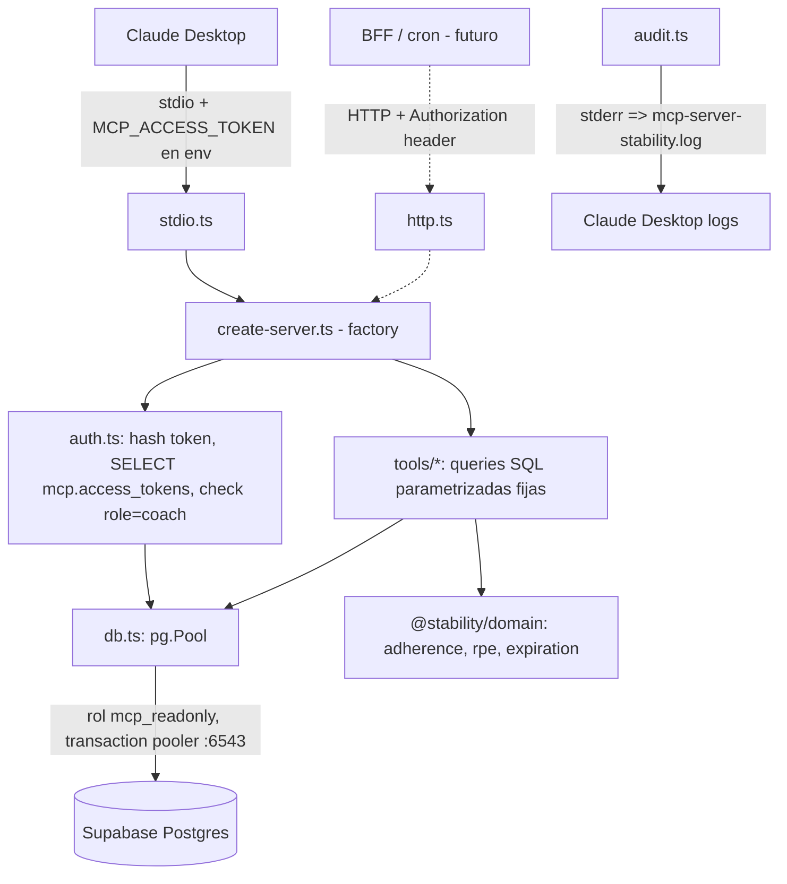
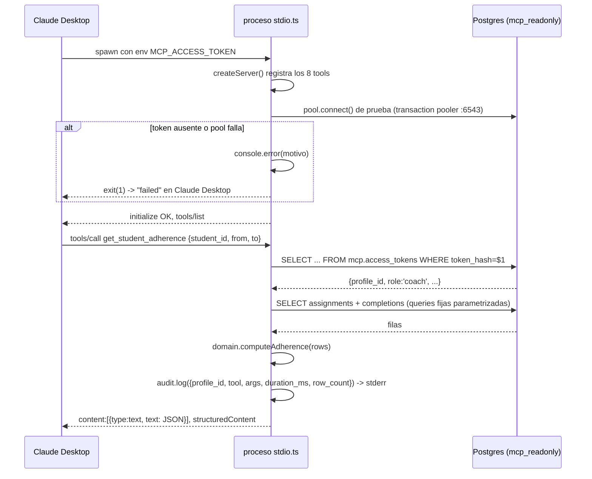

# Design: MCP Server para Sistema Alfa

**Status:** Revisado (pendiente re-aprobación) — cambio de repo destino
**Last updated:** 2026-09-02
**Aprobado por:** Máximo — 2026-08-30 (versión previa); revisión de estructura pendiente
**Requirements:** [requirements.md](./requirements.md)

> **Nota de revisión (2026-09-02):** el trabajo previo se hizo contra el repo equivocado
> (`MaximoFini/StabilitySistema`). El repo real es `RamiroC7/StabilitySistemaRami`, con la app
> **en la raíz** (no bajo `professors-platform/`), que ya tiene `.github/workflows/ci.yml`,
> Vitest y `api/` (funciones serverless de Vercel). Esta versión ajusta la estructura del monorepo
> a ese repo. El proyecto Supabase es el mismo (`hcvytsitbsandaphsxyn`, producción confirmada) y
> el cálculo de adherencia de la app no cambió — las decisiones de fondo se mantienen.

## Overview

Se construye un servidor MCP en TypeScript que expone 8 tools de solo lectura sobre la base Postgres de Supabase. El servidor:

- Define cada tool **una sola vez** y la monta en dos transports (stdio y HTTP) vía una factory compartida (D-1). En esta fase solo se usa stdio, local, en Claude Desktop.
- Conecta a Postgres con un **rol dedicado `mcp_readonly`** que solo tiene `GRANT SELECT` y `default_transaction_read_only = on` — un intento de escritura falla en la base, no por convención (D-2, US-8).
- Autentica cada request con un **token personal** que resuelve a un `profiles.id` y exige `role = 'coach'` (US-7). La identidad solo se usa para auditoría en log (D-3); no cambia qué datos se ven, porque todos los coaches ven todo.
- Comparte con la app un paquete `@stability/domain` que contiene **solo tipos y funciones de derivación puras** (cálculo de adherencia, alerta de RPE, estado de vencimiento). El acceso a datos NO se comparte: la app usa PostgREST vía `supabase-js`, el server usa SQL vía `pg` (consecuencia de D-2).

La Fase 1 (preparación) es mínima: **la app no se mueve**. Se agrega el campo `workspaces` al `package.json` de la raíz y se crean `packages/domain` y `packages/mcp-server`. El `ci.yml` existente se extiende con un job para los paquetes nuevos. No se toca la lógica de escritura ni los stores, y el diff sobre el código de la app es de pocas líneas.

## Architecture

### Estructura del monorepo (Fase 1) — repo real, app en la raíz

El repo real (`RamiroC7/StabilitySistemaRami`) tiene la app en la raíz, en un solo `package.json` (`professors-platform`, v0.0.0). Se convierte en **workspace root sin mover la app**:

```
/  (raíz del repo)
├─ package.json          # + "workspaces": ["packages/*"]  (la app sigue siendo ESTE paquete)
├─ src/                   # la SPA — SIN CAMBIOS
├─ api/                   # funciones serverless de Vercel — SIN CAMBIOS
├─ index.html  vite.config.ts  tsconfig*.json  vitest.setup.ts  vercel.json   # SIN CAMBIOS
├─ .github/workflows/ci.yml       # se EXTIENDE (job nuevo para packages/*)
├─ tsconfig.base.json             # NUEVO: compilerOptions comunes que hereda cada package
├─ packages/
│  ├─ domain/                     # name: "@stability/domain" — corre en browser Y en Node
│  │  ├─ package.json             # deps: date-fns únicamente. SIN react/supabase-js/vite
│  │  ├─ tsconfig.json            # extends ../../tsconfig.base.json, module node16, sin lib DOM
│  │  ├─ scripts/check-node-safe.mjs
│  │  └─ src/
│  │     ├─ index.ts
│  │     ├─ types.ts              # SOLO tipos escritos a mano (AdherenceInput/Result, RpeAlert, ExpirationStatus). NO el tipo Database generado
│  │     ├─ rpe.ts                # copiado de src/lib/rpeHelpers.ts (detectRpeAlert) + su .test.ts. CI verifica que no diverja
│  │     ├─ adherence.ts          # NUEVO (fórmula propia, ver Key flows). No existe equivalente en la app
│  │     ├─ expiration.ts         # lógica pura extraída de src/features/students/PlanExpirations.tsx (sin JSX)
│  │     └─ dates.ts              # helpers de fecha/TZ compartidos
│  └─ mcp-server/                 # name: "@stability/mcp-server"
│     ├─ package.json  tsconfig.json  .env.example
│     ├─ scripts/mint-token.ts
│     └─ src/
│        ├─ db.ts                 # pg.Pool a nivel módulo
│        ├─ rows.ts               # tipos de fila angostos: solo las columnas que consultan los tools
│        ├─ auth.ts  audit.ts
│        ├─ create-server.ts      # factory: () => McpServer con todos los tools
│        ├─ tools/                # una función registradora por tool
│        ├─ stdio.ts              # entrypoint 1
│        └─ http.ts               # entrypoint 2 (escrito ahora, desplegado después)
└─ supabase/
   ├─ schema/                     # snapshot ya generado (D-4)
   └─ migrations/
      └─ 20260902_mcp_server_setup.sql   # rol + grants + policies + schema mcp
```

**Por qué no se mueve la app a `apps/web/`:** el repo tiene un equipo activo con ramas abiertas. Mover ~100 archivos rompería todo merge en vuelo, obligaría a reconfigurar Vercel y el `ci.yml`, y no aporta nada al MCP server (que no comparte código de UI). El único beneficio sería cosmético. Se descarta.

**Relación `domain` ↔ app:** en esta fase `@stability/domain` NO se consume desde la app (evita tocar imports del código en producción). `rpe.ts` es una **copia** de `src/lib/rpeHelpers.ts` (~15 líneas, pura); el CI verifica con `diff` que no diverjan. `types.ts` NO copia el tipo `Database` generado — solo tiene tipos escritos a mano. `packages/mcp-server/src/rows.ts` define sus propios tipos de fila angostos (las columnas que consultan los tools), sin depender del `src/lib/supabase.ts` de la app. La unificación de `rpeHelpers` —que la app importe de `@stability/domain`— se hace en el spec de correcciones, junto con el fix del bug de adherencia.

Restricción dura sobre `@stability/domain`: **no puede importar `react`, `zustand`, `@supabase/supabase-js`, ni usar `import.meta.env`, `localStorage`, `navigator` o `window`.** El script `check-node-safe.mjs` lo verifica en CI.

### Componentes en runtime



## Data model

### Cambios en la base (migración `20260902_mcp_server_setup.sql`)

Todo aditivo. No modifica tablas, policies ni funciones existentes.

```sql
-- 1) Schema separado para artefactos del MCP
create schema if not exists mcp;

-- 2) Tabla de tokens de acceso (la escribe el admin desde el dashboard; el server solo la lee)
create table mcp.access_tokens (
    id           uuid primary key default gen_random_uuid(),
    token_hash   text not null unique,          -- sha256(token) en hex
    profile_id   uuid not null references public.profiles(id) on delete cascade,
    label        text not null,                 -- "Claude Desktop de Máximo"
    created_at   timestamptz not null default now(),
    expires_at   timestamptz,                   -- null = sin expiración
    revoked_at   timestamptz                    -- no null = revocado
);
alter table mcp.access_tokens enable row level security;  -- sin policies => nadie salvo superuser/grants explícitos

-- 3) Rol de solo lectura
create role mcp_readonly with login password :'mcp_pw'
    noinherit nocreatedb nocreaterole nosuperuser;

alter role mcp_readonly set default_transaction_read_only = on;
alter role mcp_readonly set statement_timeout = '15s';
alter role mcp_readonly set idle_in_transaction_session_timeout = '30s';
alter role mcp_readonly connection limit 5;

-- 4) Grants: SELECT sobre exactamente las 7 tablas que usan los tools, + tabla de tokens
grant usage on schema public, mcp to mcp_readonly;
grant select on
    public.profiles,
    public.training_plans,
    public.training_plan_days,
    public.training_plan_exercises,
    public.training_plan_assignments,
    public.workout_completions,
    public.exercise_weight_logs,
    mcp.access_tokens
  to mcp_readonly;

-- 5) Policies explícitas TO mcp_readonly. Sin esto, RLS default-deny => 0 filas.
--    USING (true) porque el modelo es "todos los coaches ven todo" (confirmado con el usuario).
create policy mcp_ro_read on public.profiles                  for select to mcp_readonly using (true);
create policy mcp_ro_read on public.training_plans            for select to mcp_readonly using (true);
create policy mcp_ro_read on public.training_plan_days        for select to mcp_readonly using (true);
create policy mcp_ro_read on public.training_plan_exercises   for select to mcp_readonly using (true);
create policy mcp_ro_read on public.training_plan_assignments for select to mcp_readonly using (true);
create policy mcp_ro_read on public.workout_completions       for select to mcp_readonly using (true);
create policy mcp_ro_read on public.exercise_weight_logs      for select to mcp_readonly using (true);
create policy mcp_ro_read on mcp.access_tokens                for select to mcp_readonly using (true);
```

**Tablas deliberadamente excluidas de los grants:**
- `student_profiles` — contiene PII (teléfono, lesiones, condiciones médicas). Ningún tool de v1 la necesita: US-1 se resuelve con `profiles` + `training_plan_assignments`. Si un tool futuro la necesita, se agrega grant + policy en su propia migración.
- `exercise_stages` — `training_plan_exercises.stage_name` ya está desnormalizado; alcanza para US-6.
- `get_monthly_ranking` — no hay ningún tool que lo use en v1.

### Sin nuevos índices

La base entera son ~9.500 filas (mayor tabla: `training_plan_exercises`, 5.565). Postgres resuelve todo con seq scan o bitmap-and de los índices simples existentes en < 5 ms. Los índices compuestos quedan como deuda registrada para cuando `workout_completions` supere ~50k filas.

## Interfaces / contracts

### Autenticación (no es un tool — corre antes de cada dispatch)

- **Input (stdio):** variable de entorno `MCP_ACCESS_TOKEN` leída al arrancar el proceso.
- **Input (HTTP, futuro):** header `Authorization: Bearer <token>` por request.
- **Proceso:** `sha256(token)` → `SELECT profile_id, expires_at, revoked_at FROM mcp.access_tokens WHERE token_hash = $1` → join `profiles` para traer `role`, `first_name`, `last_name`.
- **Acepta si:** el hash existe, `revoked_at IS NULL`, (`expires_at IS NULL` OR `expires_at > now()`), y `profiles.role = 'coach'`.
- **Errores:** cualquier fallo → se responde un único error MCP `"No autorizado"` sin distinguir la causa (US-7). En stdio, si el token falta o es inválido al arrancar, el server loguea a stderr y sale con código ≠ 0 (Claude Desktop lo marca como failed).
- **Auditoría:** cada tool call exitosa emite a stderr una línea JSON: `{ ts, profile_id, coach_name, tool, args, duration_ms, row_count }`. En stdio eso va a `%APPDATA%\Claude\logs\mcp-server-stability.log`.

### Tools

Todos: `annotations: { readOnlyHint: true, destructiveHint: false, idempotentHint: true, openWorldHint: false }`. Input schema en Zod v4. Todos devuelven `content: [{ type: "text", text: <JSON.stringify del resultado> }]` y, cuando aporta, `structuredContent`. Los errores de dominio ("alumno no existe") se devuelven como `isError: true` con un texto que nombra el problema y sugiere el arreglo — nunca se filtra el mensaje crudo de Postgres.

#### `list_students` — US-1

- **Input:** `{ status?: "active" | "archived" | "all" }` (default `"active"`)
- **Output:** `Array<{ student_id, first_name, last_name, is_archived, has_active_assignment, active_plan_title: string | null }>`
- **Query:** `profiles` (role = 'student') LEFT JOIN LATERAL sobre `training_plan_assignments` (status = 'active') + `training_plans` para el título. Filtro por `profiles.is_archived` según `status`.
- **Errores:** lista vacía si nadie matchea (no es error).

#### `get_student_adherence` — US-2

- **Input:** `{ student_id: string (uuid), from: string (YYYY-MM-DD), to: string (YYYY-MM-DD) }`
- **Output:** `{ student_id, from, to, has_assignment_in_range: boolean, expected_workouts: number, completed_workouts: number, adherence_pct: number | null, assignments: Array<{ assignment_id, plan_title, start_date, end_date, status, days_per_week, overlap_weeks: number }>, completions: Array<{ completed_at_local, day_number, rpe }>, note: string }`
- **Cálculo:** fórmula propia y correcta (NO replica la app — ver `notes-adherence.md` §10 para por qué la app no sirve de referencia). Definida en `@stability/domain/adherence.computeAdherence`:
  - **esperados** = Σ sobre asignaciones con `status != 'cancelled'` que solapan `[from, to]` de `days_per_week × overlap_weeks`, donde `overlap_weeks = (días del solapamiento [asignación ∩ rango]) / 7` (fracción, no redondeada).
  - **completados** = `workout_completions` del alumno con `completed_at` (convertido a `America/Argentina/Buenos_Aires`) en `[from, to]`, deduplicadas por `(day_number, fecha_local)`.
  - **adherence_pct** = `round(completados / esperados × 100)`, sin cap (puede pasar 100). `null` si `esperados == 0`.
  - **zona horaria**: `America/Argentina/Buenos_Aires` para todos los límites.
  - `note` siempre incluye: `"Cálculo propio del MCP; no corresponde a ninguna pantalla de la app."`
- `has_assignment_in_range = false` → `adherence_pct = null` + `note` explica que no hay plan en el rango (US-2).
- **Errores:** `student_id` no existe o no es `role = 'student'` → `isError`, texto: `"No hay ningún alumno con id <x>."`. `from > to` → `isError`.

#### `get_exercise_progression` — US-3

- **Input:** `{ student_id: string (uuid), exercise: string, from?: string, to?: string }`
- **Output:** `{ student_id, exercise_query, matched_exercise_names: string[], sets: Array<{ logged_at, plan_day_name, series, sets_detail: Array<{ set_number, target_reps, actual_reps, kg }> }> }`
- **Matching aproximado:** `WHERE unaccent(lower(exercise_name)) LIKE unaccent(lower('%'||$2||'%'))`. Requiere la extensión `unaccent` — verificar si está habilitada; si no, fallback a `lower()` sin `unaccent` y se documenta la limitación.
- **Errores:** sin registros → `sets: []` + mensaje "sin registros de carga" (no es error, US-3).

#### `get_expiring_plans` — US-4

- **Input:** `{ within_days: number (int, 1..90) }` (default 7)
- **Output:** `Array<{ assignment_id, student_id, student_name, plan_title, end_date, days_until_expiry: number, is_overdue: boolean }>` ordenado por `end_date` ASC.
- **Query:** `training_plan_assignments` (status = 'active') con `end_date <= now() + within_days` — incluye vencidas (`end_date < now()`), marcadas `is_overdue = true` (US-4).

#### `get_rpe_alerts` — US-5

- **Input:** `{}` (sin parámetros)
- **Output:** `Array<{ student_id, student_name, recent_rpe: number[], alert: true }>` — solo alumnos en alerta.
- **Cálculo:** por cada alumno con completions, se toman los últimos N `workout_completions` ordenados por `completed_at` DESC y se pasa por `@stability/domain/rpe.detectRpeAlert` — **la misma regla que la app** (US-5).

#### `list_plans` — US-6

- **Input:** `{ include_templates?: boolean }` (default `false`)
- **Output:** `Array<{ plan_id, title, total_days, days_per_week, assigned_count, is_template }>` — solo `is_archived = false`.

#### `get_plan` — US-6

- **Input:** `{ plan_id: string (uuid) }`
- **Output:** `{ plan_id, title, description, days: Array<{ day_number, day_name, exercises: Array<{ order, stage_name, exercise_name, series, reps, carga, pause, notes }> }> }` — ejercicios ordenados por `display_order`.
- **Errores:** plan no existe → `isError`.

## Key flows

### Arranque en modo stdio y primer tool call



### Cálculo de adherencia (US-2) — fórmula propia

La app **no** tiene un cálculo de adherencia por alumno para un rango (T0.3 / `notes-adherence.md`): el único % por alumno es de la semana actual y con denominador bugueado. El MCP define su propia fórmula, correcta y explícita:

```ts
// packages/domain/src/adherence.ts
export interface AdherenceInput {
  from: string;              // "YYYY-MM-DD" (inclusive, 00:00 en TZ)
  to: string;                // "YYYY-MM-DD" (inclusive, 23:59:59.999 en TZ)
  timeZone: string;          // "America/Argentina/Buenos_Aires"
  assignments: Array<{
    id: string; start_date: string; end_date: string;
    status: string;          // 'cancelled' se excluye
    days_per_week: number;   // training_plans.days_per_week (NO total_days)
  }>;
  completions: Array<{ completed_at: string; day_number: number }>;  // ISO UTC
}
export interface AdherenceResult {
  hasAssignmentInRange: boolean;
  expectedWorkouts: number;         // fraccional posible antes de redondeo final del pct
  completedWorkouts: number;        // dedup por (day_number, fecha local)
  adherencePct: number | null;      // null si expectedWorkouts == 0
  perAssignment: Array<{ id: string; overlapWeeks: number; expected: number }>;
}
export function computeAdherence(input: AdherenceInput): AdherenceResult;
```

Reglas (todas verificables con tests unitarios sobre casos escritos a mano — NO contra la app):

1. Para cada assignment con `status != 'cancelled'`: `overlapDays = max(0, min(to, end_date) − max(from, start_date) + 1 día)` en la TZ; `overlapWeeks = overlapDays / 7` (fracción); `expected_i = days_per_week × overlapWeeks`.
2. `expectedWorkouts = Σ expected_i`.
3. `completedWorkouts` = completions con `completed_at` en TZ dentro de `[from, to]`, contando pares `(day_number, fecha_local)` únicos.
4. `adherencePct = expectedWorkouts > 0 ? round(completedWorkouts / expectedWorkouts × 100) : null`. Sin cap superior.
5. `hasAssignmentInRange` = hubo al menos un assignment no cancelado con `overlapDays > 0`.

**Decisión explícita sobre `days_per_week`:** se usa `training_plans.days_per_week` (el campo semántico correcto), NO `total_days` como hace la app. Si `days_per_week` es `null`, fallback a `total_days / total_weeks` redondeado, y si tampoco, a `3`. Documentado en el código y en el `note` de la respuesta.

**Caveat de la cola offline (T0.3 rev. 2026-09-02):** `src/lib/offlineWorkoutQueue.ts` no genera completions duplicadas (UUID de cliente + `upsert onConflict:id`), pero **sí desfasa `completed_at`**: al sincronizar, la DB usa `default now()`, no el momento real del entrenamiento (`queuedAt` se captura pero no se persiste). Entrenar offline el sábado y sincronizar el lunes → la completion cae en otra semana ISO. El MCP **no puede corregir esto** desde su lado; queda documentado en el `note` de la respuesta. El fix real (que la app persista `queuedAt` como `completed_at`) va al spec de correcciones.

**Helpers ya existentes en el repo real que se reutilizan:**
- `src/lib/rpeHelpers.ts` → `detectRpeAlert` — pura, ya con tests. US-5 la usa tal cual (copiada a `domain/rpe.ts`).
- `src/lib/pendingDay.ts` → `selectPendingDay(...)` — pura, `now` inyectable, 7 tests. No la necesita US-2 directamente (calcula "próximo día pendiente", no adherencia), pero confirma que el equipo ya trabaja con funciones puras + `now` inyectable, el mismo patrón que `computeAdherence`.

La app no se toca: sigue con `calculateWeekAttendance`. `computeAdherence` es nueva y vive solo en `packages/domain`; el spec de corrección de la app la adopta más adelante.

### Una definición, dos transports (D-1)

```ts
// packages/mcp-server/src/create-server.ts
import { McpServer } from "@modelcontextprotocol/server";
import { registerAllTools } from "./tools/index.js";
export function createServer(): McpServer {
  const server = new McpServer({ name: "stability-db", version: "1.0.0" });
  registerAllTools(server);          // <- única definición de tools
  return server;
}

// packages/mcp-server/src/stdio.ts
import { serveStdio } from "@modelcontextprotocol/server/stdio";
import { assertAuthFromEnv } from "./auth.js";
await assertAuthFromEnv();            // valida MCP_ACCESS_TOKEN o exit(1)
serveStdio(createServer);
console.error("stability-db stdio listo");

// packages/mcp-server/src/http.ts   (escrito ahora, NO desplegado en esta fase)
import { createMcpHandler } from "@modelcontextprotocol/server";
import { createMcpExpressApp } from "@modelcontextprotocol/express";
const app = createMcpExpressApp({ allowedHosts: [process.env.MCP_HOST ?? "localhost"] });
// ... monta createMcpHandler(createServer) en POST /mcp, auth por header
```

El `pg.Pool` vive en `db.ts` a nivel de módulo (una vez), no dentro de la factory — en HTTP la factory corre por request.

## Trade-offs and alternatives considered

| Decisión | Elegido | Alternativa descartada | Por qué |
|---|---|---|---|
| **Estrategia RLS del rol** | Policies explícitas `TO mcp_readonly USING (true)` sobre 7 tablas | (a) `BYPASSRLS` en el rol; (b) inyectar el JWT del coach por conexión | (a) `BYPASSRLS` puede no ser otorgable sin superuser en este plan de Supabase (a verificar), es una herramienta roma, y no queda visible en el dashboard. (b) reproduce fielmente la app **incluyendo el bug de `exercise_weight_logs`** (coach ve solo sus alumnos), lo opuesto a lo que se pидió para US-3; además `auth.uid()` sería NULL sin setear el GUC. Las policies explícitas implementan el modelo *deseado* ("todos ven todo"), son auditables y son 8 líneas de SQL. |
| **Driver de base** | `pg` con rol `mcp_readonly` | `supabase-js` con service-role o con JWT de coach | `supabase-js` + service-role no da garantía estructural de solo-lectura (US-8). `supabase-js` + JWT de coach arrastra RLS y su costo. El precio de `pg` es no compartir la capa de queries con la PWA — aceptable, y de hecho permite agregar en SQL. |
| **Versión del SDK MCP** | `@modelcontextprotocol/server` **v2.0.0** | `@modelcontextprotocol/sdk` v1.30.0 | v2 tiene el patrón factory/dos-transports resuelto de fábrica y Zod v4 nativo (el proyecto ya usa Zod v4). **Riesgo real: es un major de ~1 mes, poco rodado.** Mitigación: v1 sigue con bugfixes ≥6 meses y existe codemod de migración; si v2 da problemas serios en implementación, se baja a v1 con el patrón manual. |
| **Auditoría (D-3)** | Línea JSON estructurada a stderr → log de Claude Desktop | Tabla `mcp.audit_log` con un writer con INSERT | Una tabla de auditoría obliga a una segunda conexión con permiso de escritura, lo que perfora "el server no puede escribir" (US-8). Para la Fase 2 (solo stdio, un usuario) el log a stderr cumple D-3. Cuando llegue el deploy HTTP se reevalúa con un writer acotado a `INSERT` sobre esa única tabla. |
| **Alcance de `packages/domain`** | Tipos a mano + `rpe` (copia) + `expiration` (extraída) + `adherence` (nueva). La app NO lo consume aún | Extraer toda la capa de datos de `hooks/`; o hacer que la app importe ya de `@stability/domain` | Como el acceso a datos no se comparte (driver `pg`), extraer los hooks no aporta nada al MCP y multiplica el riesgo de regresión. Hacer que la app importe del paquete ahora agranda el PR con cambios en archivos de producción y choca con el equipo activo — se difiere al spec de correcciones. En esta fase: PR aditivo, `rpe.ts` copiado con guard de `diff` en CI. |
| **`types.ts` del paquete** | Solo tipos escritos a mano; el server define sus filas angostas en `rows.ts` | Copiar el tipo `Database` generado (~350 líneas) de `src/lib/supabase.ts` | El server consulta con `pg` crudo, no con `supabase-js` — no necesita el tipo generado. Tipos angostos por tool son más chicos, más claros, y cero acoplamiento al `supabase.ts` de la app. |
| **Fórmula de adherencia (US-2)** | Fórmula propia correcta + datos crudos en la respuesta | (a) Replicar `calculateWeekAttendance` con su bug; (b) devolver solo datos crudos sin %; (c) replicar el cálculo mensual de `useBusinessMetrics` | Decidido con el usuario 2026-08-30 tras descubrir en T0.3 que la app no tiene un cálculo de adherencia por-alumno-por-rango válido. (a) propaga un bug y solo cubre la semana actual. (b) deja la aritmética al modelo, con varianza. (c) es agregado de todos los alumnos y ventana mensual fija. La fórmula propia es correcta, cubre rango arbitrario, y los datos crudos en la respuesta dejan que el coach verifique. |
| **`student_profiles` en los grants** | Excluida | Incluir para enriquecer `list_students` | Es la tabla con más PII (lesiones, condiciones médicas). Ningún tool de v1 la necesita. Exponerla a un LLM sin una razón concreta es superficie regalada. |
| **Transport de conexión** | Transaction pooler (`:6543`), user `mcp_readonly.hcvytsitbsandaphsxyn` | Conexión directa (`db.<ref>.supabase.co:5432`) | La directa resuelve solo a IPv6 sin el add-on pago; desde una red doméstica sin IPv6 nativo falla. El proceso stdio corre en la máquina del coach → pooler IPv4, que además está pensado para conexiones efímeras. |
| **Tool genérico `run_sql`** | No existe; 8 tools con queries fijas | Un tool que acepta SQL del modelo | Un `run_sql` anula casi todo el scoping y abre exfiltración vía prompt injection en los propios datos. El rol read-only lo contendría en daño, pero no en alcance de lectura. |

## Requirement traceability

| Criterio (requirements.md) | Dónde se resuelve |
|---|---|
| US-1 (listado de alumnos, filtro, lista vacía) | tool `list_students` |
| US-2 (adherencia con fórmula propia documentada, datos crudos, TZ Buenos Aires, excluye cancelled, sin asignación → null + nota, id inválido → error, from>to → error) | tool `get_student_adherence` + `domain/adherence.computeAdherence` + tests unitarios |
| US-3 (progresión cronológica, match aproximado, sin registros → vacío) | tool `get_exercise_progression` + `unaccent` LIKE |
| US-4 (vencimientos en ventana, incluye vencidas marcadas) | tool `get_expiring_plans` |
| US-5 (alertas RPE con la regla de la app, devuelve los valores) | tool `get_rpe_alerts` + `domain/rpe.detectRpeAlert` |
| US-6 (listar planes con conteos; detalle con días y ejercicios ordenados) | tools `list_plans` + `get_plan` |
| US-7 (sin token → rechazo opaco; no-coach → rechazo; expirado/revocado → rechazo; revocable sin redeploy; hash) | `auth.ts` + `mcp.access_tokens` |
| US-8 (solo tools de lectura; escritura falla a nivel DB) | rol `mcp_readonly`: solo `GRANT SELECT` + `default_transaction_read_only = on`; sin tool `run_sql` |
| US-9 (monorepo buildea y deploya igual; comportamiento de la app sin cambios) | campo `workspaces` en el `package.json` raíz + `packages/*` nuevos, la app NO se mueve + `ci.yml` extendido + smoke test |

## Open questions / risks

1. **RESUELTO (T0.1, 2026-08-30).** `postgres` tiene `rolcreaterole = true` y `rolbypassrls = true`. Puede crear el rol y otorgar grants. El probe DDL directo no corre por el conector (transacción read-only) pero `apply_migration` es transaccional: si `CREATE ROLE` fallara, rollback total. Se folda la verificación en la migración de T4.
2. **RESUELTO (T0.2, 2026-08-30).** `unaccent` no está instalada pero está disponible (`pg_available_extensions`). La migración incluye `create extension if not exists unaccent with schema extensions;`.
3. **RESUELTO (T0.3).** La app no tiene cálculo de adherencia por-alumno-por-rango. El MCP usa fórmula propia (design.md §Key flows). `notes-adherence.md` tiene el relevamiento completo.
4. **RESUELTO.** Se usa `days_per_week × overlap_weeks`, con `days_per_week` = el campo semántico (no `total_days`). Decidido con el usuario.
5. **Rotación del password de `mcp_readonly`.** Vive en `claude_desktop_config.json` en texto plano (y en el `.env` del server para HTTP futuro). Aceptable para Fase 2 local; documentar cómo rotarlo. No hay secreto-manager en el alcance.
6. **Contradicción de modelo ya resuelta pero anotada:** las policies reales de `exercise_weight_logs` restringen "coach del alumno". Este diseño las ignora (usa `USING (true)` para `mcp_readonly`) porque el usuario confirmó que el modelo deseado es "todos ven todo". La corrección de esa policy en la app va en un spec aparte.
7. **Dos bugs de seguridad preexistentes** (borrado de planes sin check de identidad; PII de alumnos legible por cualquier alumno) — fuera de alcance, spec aparte acordado. Anotados en `supabase/schema/policies.sql`.
