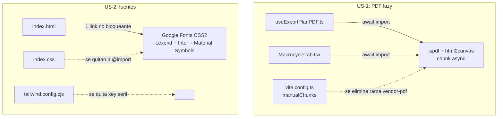
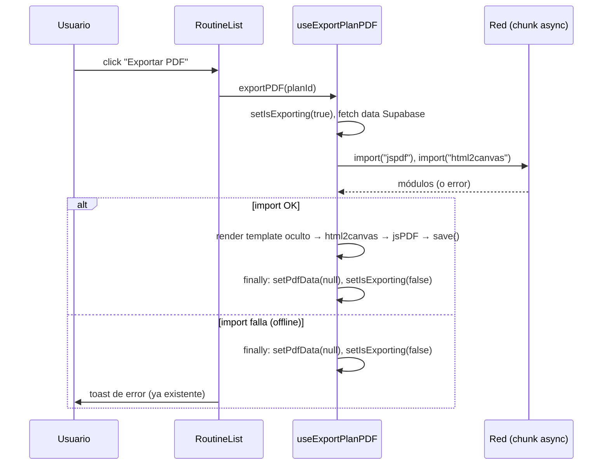

# Design: PWA cold-start performance — fase 1 (JS crítico + fuentes)

**Status:** Approved
**Last updated:** 2026-09-06
**Requirements:** [requirements.md](./requirements.md)

## Overview

Dos cambios independientes, ambos de bajo riesgo y localizados:

1. **US-1** — Convertir los imports de `jspdf` / `html2canvas` de estáticos a
   dinámicos (`await import(...)`) dentro de las funciones que generan el PDF, y
   eliminar la regla `vendor-pdf` de `manualChunks` en `vite.config.ts`. Con eso
   Rollup mueve esas libs a un chunk async que sólo se pide al exportar, y el
   helper `__vitePreload` deja de quedar atrapado en el chunk de PDF → el entry
   ya no lo importa estáticamente → `dist/index.html` deja de precargarlo.

2. **US-2** — Unificar las 6 solicitudes de fuentes (3 en `index.html` + 3
   `@import` en `index.css`) en **una sola** hoja de estilos combinada, cargada
   de forma no bloqueante, sin Playfair. Quitar los `@import` externos de
   `index.css`. Limpiar la clave `serif` muerta de Tailwind.

Ningún cambio afecta la lógica de negocio; el resultado visual y funcional es
idéntico salvo por el timing de carga.

## Architecture

Componentes tocados y su rol:



Estado del bundle **después** del cambio (esperado):

- `dist/index.html` → `modulepreload` sólo de: `vendor-react`, `vendor-router`,
  `vendor-ui`, `vendor-supabase`, entry. **Sin `vendor-pdf`.**
- Nuevo chunk async (nombre autogenerado por Rollup, tipo `jspdf-XXstring.js` /
  `html2canvas-XXstring.js` o un chunk combinado) que sólo se descarga cuando se
  llama a `exportPDF` / `exportMacrocyclePDF`.
- Payload bloqueante JS+CSS gzip: de ~360 KB → ~190 KB.

## Data model

Sin cambios. No hay estructuras de datos nuevas ni migraciones.

## Interfaces / contracts

### `useExportPlanPDF()` — hook

Firma pública **sin cambios**: sigue devolviendo
`{ templateRef, pdfData, isExporting, exportPDF }`.

- **Input:** `exportPDF(planId: string)` — igual que hoy.
- **Output:** `Promise<void>`; efecto lateral = descarga de `<titulo>.pdf`.
- **Cambio interno:** `generatePdfFromElement` pasa a ser `async` con carga
  dinámica de las libs al inicio:

  ```ts
  async function generatePdfFromElement(element: HTMLElement, fileName: string) {
    const [{ default: jsPDF }, { default: html2canvas }] = await Promise.all([
      import("jspdf"),
      import("html2canvas"),
    ]);
    // ...resto idéntico
  }
  ```

- **Errores:** si `import()` rechaza (chunk no descargable / offline), la
  excepción se propaga hasta `exportPDF`, que ya tiene `try/finally` →
  `setPdfData(null)` + `setIsExporting(false)` corren igual. El `toast.promise`
  en `RoutineList.tsx` ya muestra el estado de error. **No se agrega manejo
  nuevo**, sólo se verifica que el `finally` existente cubre este caso (lo cubre).

### `exportMacrocyclePDF(...)` — función de módulo en `MacrocycleTab.tsx`

Firma **sin cambios**:
`(macrocycle, objectives, studentName, cycleNumber, totalCycles) => Promise<void>`.

- **Cambio interno:** primera línea del cuerpo pasa de usar el `jsPDF` importado
  arriba a:

  ```ts
  async function exportMacrocyclePDF(/* ...args */) {
    const { default: jsPDF } = await import("jspdf");
    const doc = new jsPDF();
    // ...resto idéntico
  }
  ```

- **Errores:** el call site `handleExportPDF` ya hace
  `.finally(() => setExportingPDF(false))`, así que un `import()` fallido
  resetea el estado igual. Sin cambios en el call site.

### `vite.config.ts` — `build.rollupOptions.output.manualChunks`

Se elimina **sólo** este bloque:

```ts
// PDF / canvas export — only Library page
if (
  id.includes("node_modules/jspdf/") ||
  id.includes("node_modules/html2canvas/")
) {
  return "vendor-pdf";
}
```

El resto de `manualChunks` queda igual. Rollup hará el split automático en el
nuevo límite de `import()` dinámico.

### `index.html` — bloque de fuentes

**Antes** (líneas ~314-325): 3 `<link rel="stylesheet">` bloqueantes.

**Después:** una URL combinada + patrón no bloqueante. Se mantienen los 2
`preconnect` y el `preload` del logo que ya están arriba.

```html
<!-- Fuentes: una sola request, no bloqueante -->
<link
  rel="preload"
  as="style"
  href="https://fonts.googleapis.com/css2?family=Inter:wght@300;400;500;600;700&family=Lexend:wght@300;400;500;600;700&family=Material+Symbols+Outlined:wght,FILL@100..700,0..1&display=swap"
/>
<link
  rel="stylesheet"
  href="https://fonts.googleapis.com/css2?family=Inter:wght@300;400;500;600;700&family=Lexend:wght@300;400;500;600;700&family=Material+Symbols+Outlined:wght,FILL@100..700,0..1&display=swap"
  media="print"
  onload="this.media='all'"
/>
<noscript>
  <link
    rel="stylesheet"
    href="https://fonts.googleapis.com/css2?family=Inter:wght@300;400;500;600;700&family=Lexend:wght@300;400;500;600;700&family=Material+Symbols+Outlined:wght,FILL@100..700,0..1&display=swap"
  />
</noscript>
```

- El eje de Material Symbols (`wght,FILL@100..700,0..1`) se copia **tal cual**
  del `@import` actual de `index.css` — no se cambia el rendering de íconos.
- Los rangos de pesos de Lexend (300–700) e Inter (300–700) son la **unión** de
  lo que hoy piden `index.html` e `index.css` (index.html ya pedía 300–700 de
  ambas; index.css pedía 400–700 de Inter y 300–700 de Lexend). Unión = 300–700,
  sin regresión.
- `display=swap` ya viene en la URL → texto con fallback del sistema mientras
  carga, nunca invisible.

### `src/index.css` — quitar `@import` externos

Se borran las 3 primeras líneas:

```css
@import url("https://fonts.googleapis.com/css2?family=Inter:...");
@import url("https://fonts.googleapis.com/css2?family=Lexend:...");
@import url("https://fonts.googleapis.com/css2?family=Material+Symbols+Outlined:...");
```

Quedan como primeras líneas los `@tailwind base/components/utilities`. La clase
`.material-symbols-outlined` (línea ~68) **no se toca** — la fuente ahora llega
por el `<link>` de `index.html`.

### `tailwind.config.cjs` — quitar `serif` muerto

```js
fontFamily: {
  display: ["Lexend", "Inter", "sans-serif"],
  sans: ["Inter", "sans-serif"],
  // serif: ["Playfair Display", "serif"],  ← se elimina
},
```

`font-serif` no se usa en ningún componente; si en el futuro se necesita, Tailwind
cae a su stack serif por defecto.

## Key flows

### Exportar plan a PDF (después del cambio)



### Carga de fuentes (después del cambio)

1. Navegador parsea `<head>`, ve `preconnect` → abre conexión a Google Fonts.
2. Ve `<link rel="preload" as="style">` → empieza a descargar el CSS a alta
   prioridad, **sin bloquear** el render.
3. Ve `<link rel="stylesheet" media="print">` → no bloquea (media no matchea
   pantalla).
4. Primer render ocurre con fuentes del sistema (fallback).
5. Al terminar la descarga, `onload` cambia `media` a `all` → se aplican las
   fuentes web con `swap` (sin FOIT).

## Trade-offs and alternatives considered

### US-1

| Opción | Pros | Cons | Elegida |
|---|---|---|---|
| **A — `import()` dinámico + quitar rama `vendor-pdf`** | Elimina el chunk del critical path de raíz; Rollup maneja el split; cambio chico y evidente | El primer export tiene ~170 KB gzip de descarga (aceptable: acción explícita, con spinner) | **Sí** |
| B — Mantener `manualChunks`, forzar el preload-helper a otro chunk | No toca los hooks | Depende de internals de Rollup/Vite (`\0vite/preload-helper`), frágil ante upgrades; si queda algún import estático el chunk sigue pesando | No |
| C — Mantener imports estáticos, excluir `vendor-pdf` de `modulePreload` | Mínimo cambio en config | No saca la descarga, sólo baja su prioridad; incumple US-1 (igual se pide en toda ruta) | No |

### US-2

| Opción | Pros | Cons | Elegida |
|---|---|---|---|
| **A — 1 `<link>` combinado no bloqueante (`preload as=style` + `media=print/onload`) + sin `@import`** | Estándar probado; 1 request; funciona con el `runtimeCaching` existente; `<noscript>` cubre sin-JS | `onload` inline (ya hay inline scripts en el HTML, sin CSP → no es problema) | **Sí** |
| B — Self-hostear woff2 de los pesos usados | Elimina dependencia de Google + 1 dominio menos | Requiere auditar pesos exactos, agregar assets, `@font-face` propios; es la fase 2 explícitamente fuera de scope | No |
| C — Mantener `<link rel=stylesheet>` bloqueante pero deduplicado | Cambio mínimo | Sigue bloqueando el render → incumple US-2 | No |
| D — `@import` dentro de `index.css` pero deduplicado | 1 archivo | `@import` externo siempre es bloqueante + waterfall (index.css → fonts) | No |

## Requirement traceability

| Criterio (requirements.md) | Cubierto por |
|---|---|
| US-1: `index.html` sin `modulepreload` del chunk PDF | Quitar rama `vendor-pdf` de `manualChunks` + imports dinámicos → entry deja de importar estáticamente ese chunk |
| US-1: `html2canvas`/`jspdf` en chunks no importados por el critical path | `await import()` en `useExportPlanPDF.ts` y `MacrocycleTab.tsx` |
| US-1: rutas no-export no piden esos chunks | Consecuencia directa del import dinámico |
| US-1: exportar plan / macrociclo igual que hoy | Cuerpo de las funciones intacto salvo la línea de import; firmas sin cambio |
| US-1: fallo de carga dinámica no cuelga la UI | `try/finally` existente en `exportPDF` + `.finally()` existente en `handleExportPDF` (se verifica en tasks, no se agrega código) |
| US-1: `isExporting` correcto | Mismo `finally` |
| US-2: cada familia 1 sola vez | URL combinada única en `index.html` + borrar `@import` de `index.css` |
| US-2: no pedir Playfair | Se omite de la URL combinada; se borra `<link>` de Playfair; se borra key `serif` de Tailwind |
| US-2: no bloquear primer render | `preload as=style` + `media="print" onload` |
| US-2: sin `@import url()` externo en `index.css` | Borrado de las 3 líneas |
| US-2: fallback del sistema sin texto invisible | `&display=swap` en la URL |
| US-2: Lexend headings / Inter body / Material Symbols íconos igual | Pesos = unión de los actuales; eje de Material Symbols copiado literal; `.material-symbols-outlined` sin tocar |
| US-2: fallback `<noscript>` | `<noscript><link rel="stylesheet"></noscript>` |

## Open questions / risks

- **Riesgo bajo — orden de `manualChunks`:** al quitar la rama `vendor-pdf`, si
  algún día algo importa `jspdf` estáticamente de nuevo, volvería al bundle
  común. Se mitiga con la verificación de build en tasks (grep sobre
  `dist/index.html` y sobre el grafo del entry).
- **Riesgo muy bajo — `media="print"` + Workbox:** el `runtimeCaching` de Google
  Fonts matchea por URL, no por media attr; no hay impacto.
- **Nota:** `vite-plugin-pwa` `devOptions.enabled: true` hace que el SW corra en
  `npm run dev`. La verificación de bundle se hace sobre `npm run build` +
  `dist/`, no sobre el dev server.
